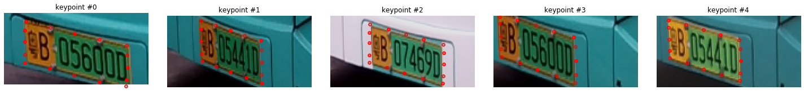

# PlateKeyPointRegression
车牌关键点定位，全卷积网络预测车牌16个关键点位置。

这里提供大约700+张车牌数据用于训练，包含训练集693，验证集41张。每张图片标注了16个关键点坐标。

具体实现见notebook。

在验证集上识别效果：

## 20200820更新

增加车牌识别,实现端到端的车牌识别和16关键点检测:

效果如图:

.png)

## 数据集 

链接: https://pan.baidu.com/s/13PDEadsQO8L_1mV5TZVz7Q 提取码: i7fi